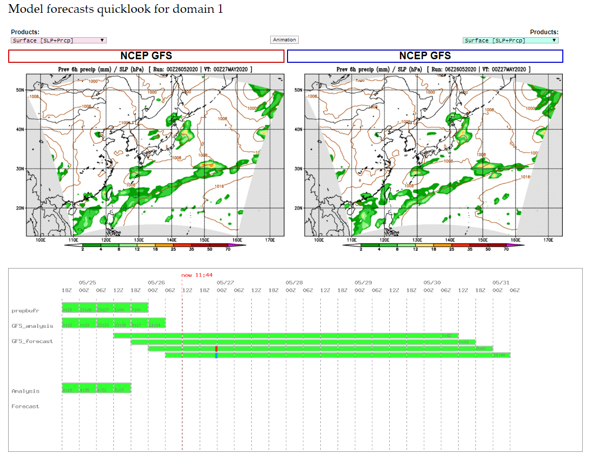
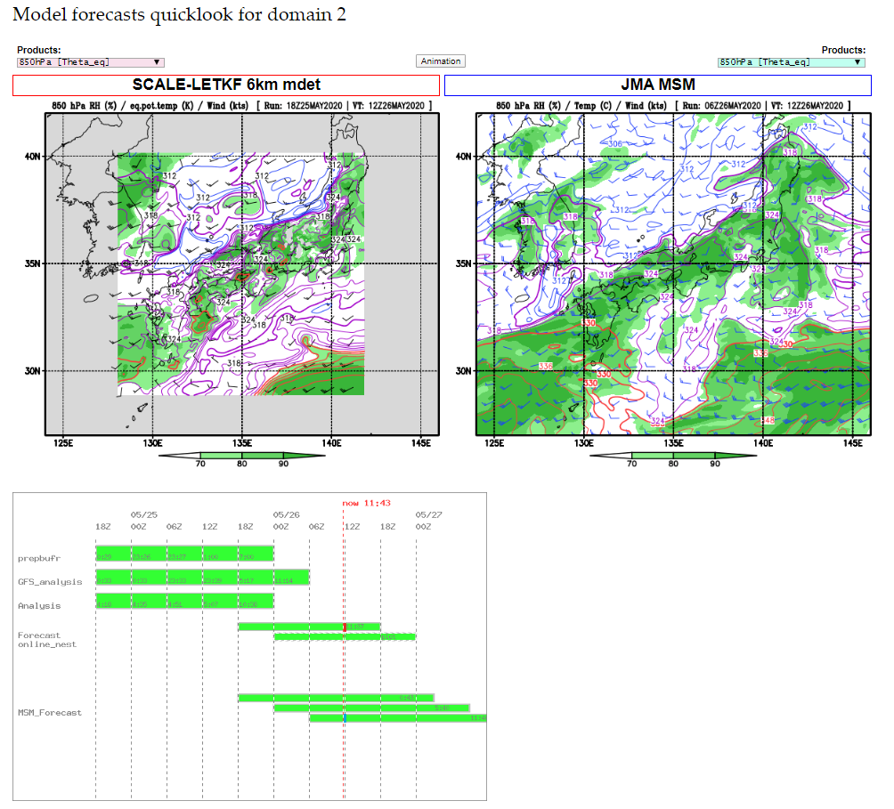
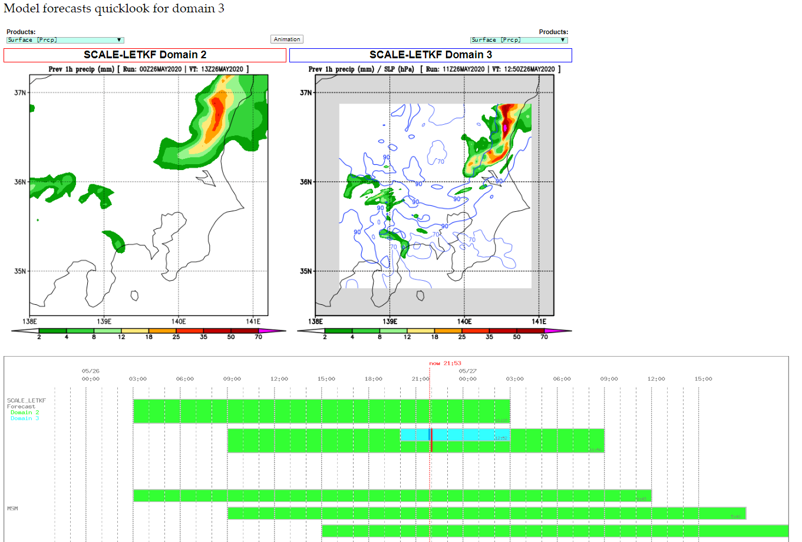
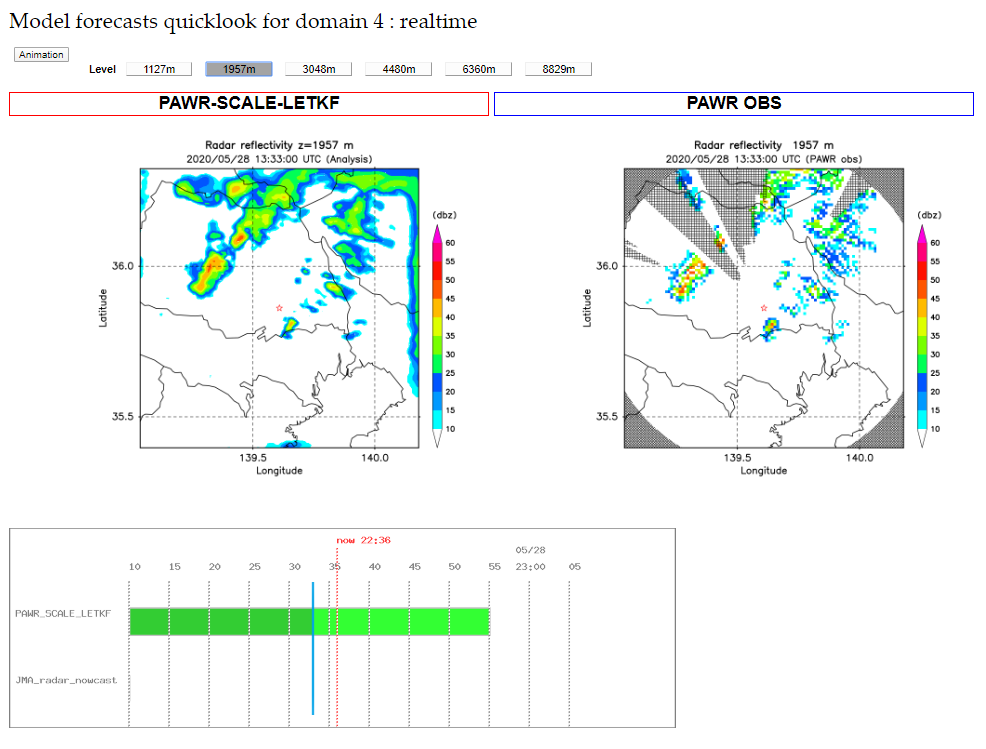

## Visualization of SCALE-LETKF on daweb

This branch contains browser-based visualization and monitoring tools for the SCALE-LETKF realtime system. 

### Browser images
#### D1


#### D2


#### D3


#### D4



### Setup

- Launch ssh-agent for auto login
```
cd 
ssh-agent | head -n 2 > ssh-agent-log.sh
ssh-add ~/.ssh/(RSA key)
(type your passphrase)
```

- Edit `sync_OFP/admin.rc` to set paths of the SCALE-LETKF directories on OFP 

### Realtime visualization

Synchronization of figures and monitoring information with the SCALE-LETKF system running on OFP is controlled by the scripts in `sync_OFP`. 

#### D1 - D3

Figures and monitoring text files for D1 to D3 can be automatically fetched from OFP by setting the crontab like `crontab_sample`.

#### D4

Visualization of D4 dacycle needs to be launched manually by `sync_OFP/sync_realtime.sh`. 
