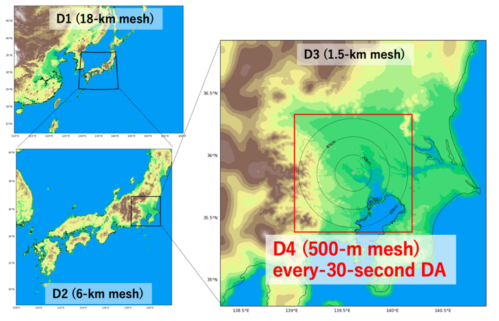
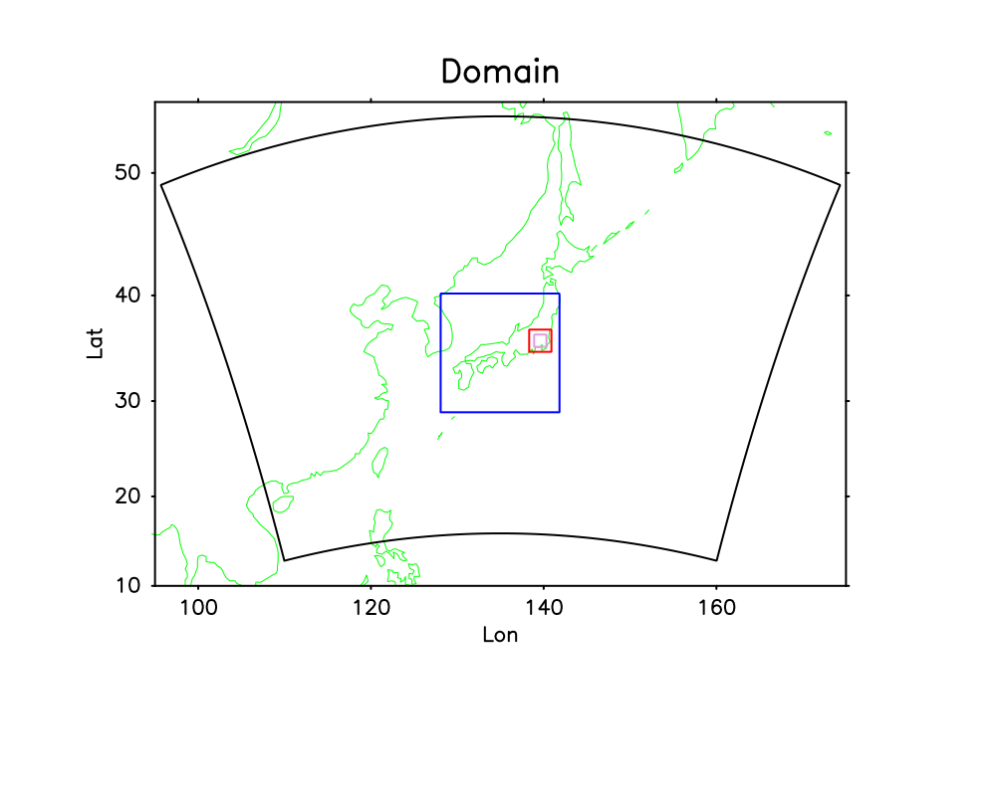
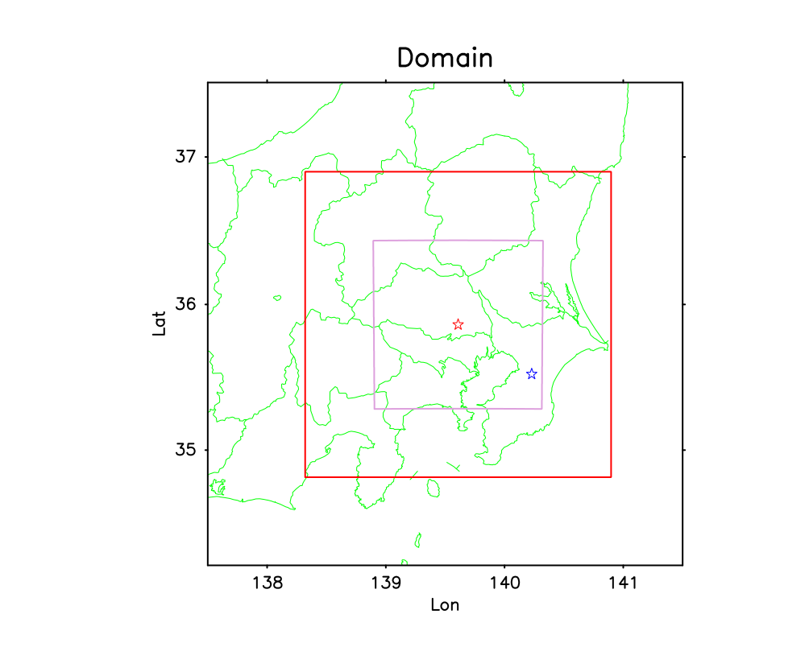

# SCALE-LETKF realtime system

## Overview
**SCALE-LETKF realtime system** is an experimental real-time forecast system for Japan area utilizing SCALE-LETKF with multiple domains. 

The system is currently running on Oakforest-PACS and produces forecasts for multiple domains every 6 hours.  

The control scripts are currently available in the branch [realtime-interface](https://github.com/gylien/scale-letkf/tree/realtime-interface) . 

Realtime forecasts are displayed at  
 [http://daweb.r-ccs27.riken.jp/~amemiya/scale/](http://daweb.r-ccs27.riken.jp/~amemiya/scale/) (R-CCS intranet).

## Analysis and forecast domains 

* Analysis

| Domain | dx | Observation data | DA Cycle length | Initial/boundary data |
| --- | --- | --- | --- |  --- | 
| [D1](realtime-D1-analysis-and-forecast.md) | 18 km | NCEP PREPBUFR | 6 hours | NCEP GFS |
| [D4](realtime-D4-analysis-and-forecast.md) | 500 m / 250 m | Phased Array Weather Radar | 30 sec | D3 forecast |

* Forecasts

| Domain | dx | Forecast length | Member | Initial/boundary data |
| --- | --- | --- |  --- |  --- | 
| [D1](realtime-D1-2-forecast.md)* | 18 km | 18 hours | 50 | D1 analysis / NCEP GFS |
| [D2](realtime-D1-2-forecast.md)* | 6 km | 18 hours | 50 | D1 forecast |
| [D3](realtime-D3-forecast.md) | 1.5 km | 6 hours | 50 | D2 forecast |
| [D4](realtime-D4-analysis-and-forecast.md) | 500 m / 250 m | 30 min | 1 | D4 analysis / D3 forecast |
| [D1](realtime-D1-analysis-and-forecast.md) (extended) | 18 km | 5 days | 1 (mdet) | D1 analysis / NCEP GFS |

\* D1 and D2 forecasts are performed as a combined online-nesting system.  

<!--  -->

## Sources
### SCALE-RM
Current version 
[https://gitlab.com/scale-met/scale/tree/LETKF-5.3.6/](https://gitlab.com/scale-met/scale/tree/LETKF-5.3.6/)  
(Do not use the master branch [http://scale.aics.riken.jp/ja/download/index.html](http://scale.aics.riken.jp/ja/download/index.html) : There are some differences including additional namelists)

### SCALE-LETKF
Domain 1,2,3 and initial/boundary conditions of domain 4 : branch [realtime_fcst_D1-3_ope](https://github.com/gylien/scale-letkf/tree/realtime_fcst_D1-3_ope)   

Domain 4 DAcycle/forecast : [dacycle_OFP_ope](https://github.com/gylien/scale-letkf/tree/dacycle_OFP_ope) 

## Getting started

See [Getting started](Getting-started.md) when you start the system from scratch. 

## References
[Miyoshi et al. 2016 *BAMS*](https://journals.ametsoc.org/doi/full/10.1175/BAMS-D-15-00144.1) 
[Miyoshi et al. 2016 *IEEE*](https://ieeexplore.ieee.org/abstract/document/7576655) 
[Lien et al. 2017](https://www.jstage.jst.go.jp/article/sola/13/0/13_2017-001/_article/-char/ja/)
